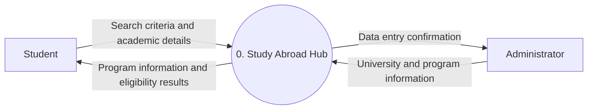

# Context-Level Data Flow Diagram

This diagram represents the interaction between external entities
and the Study Abroad Hub system.

```mermaid
flowchart LR
    S[Student]
    SYS((0. Study Abroad Hub))

    S -->|Search criteria and academic details| SYS
    SYS -->|Program information and eligibility results| S

    A[Administrator] -->|University and program information| SYS
    SYS -->|Data entry confirmation| A
```